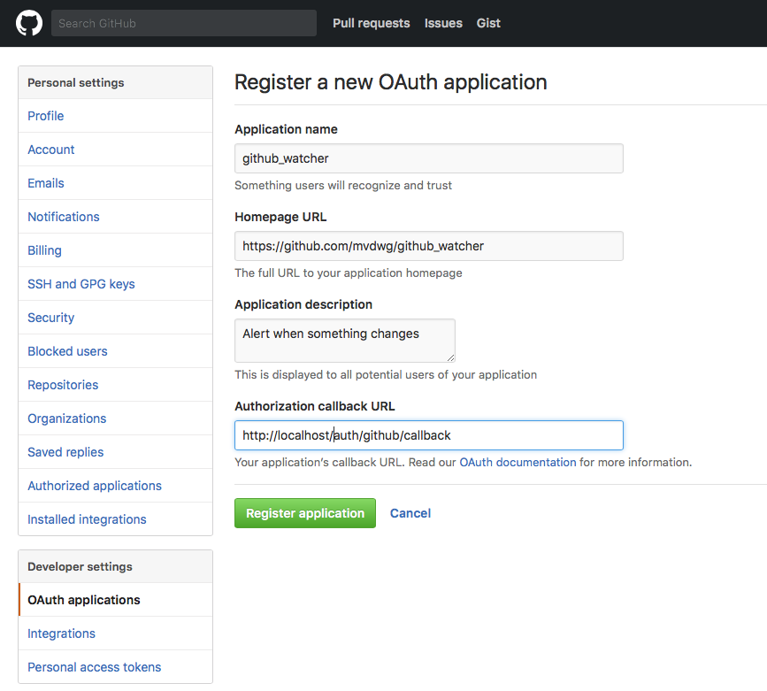

# github-watcher

Get a notification when a file or even a specific paragraph changes in a github
repository.

## Installation

Needs Ruby +2.3.3 and Postgresql

### Installing deps

```
$ git clone https://github.com/mvdwg/github-watcher.git
$ cd github-watcher
$ bundle install
```

### Creating configuration file

Create a configuration file `.env` with the following keys

```
SECRET=<random generated secret>
CLIENT_ID=<Your github's oauth client id>
CLIENT_SECRET=<Your github's ouath secret>
BUGSNAG_API_KEY=<Optional. Your bugsnag's API Key>
```

You can create a quick secret using:

```
$ echo "$(date +%s)${RANDOM}" | shasum --algorithm 512 | head -c 128
```

### OAuth keys

You'll need to register a new OAuth app in order to generate the client id/secret.



And then add the client id and secret to your `.env` file

Note, you have to set the correct URL in `Authorized callback URL`. For development it could be something like http://localhost:9292/auth/github/callback

```
CLIENT_ID=<Your github's oauth client id>
CLIENT_SECRET=<Your github's ouath secret>
```

### DB

Create a github_watcher DB (See http://stackoverflow.com/questions/30641512/create-database-from-command-line#30642050)

```
$ createdb github_watcher
```

And configure the DB connection string in your `.env` file

```
DATABASE_URL=<Your connection string>
```

or use postgres://localhost/github_watcher otherwise.

Then run all the pending migrations

```
$ bundle ex sequel --trace --migrate-directory migrations/ postgres://localhost/github_watcher
```

note, use your correct DATABASE URL instead.

## Development

To load the dev server just run

```
$ bundle exec rackup
```

and open a browser to http://localhost:9292

## LICENSE

github-watcher is licensed under the MIT license.
